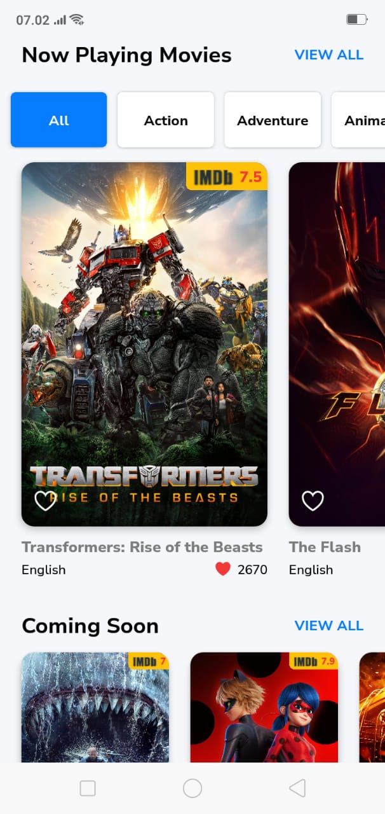
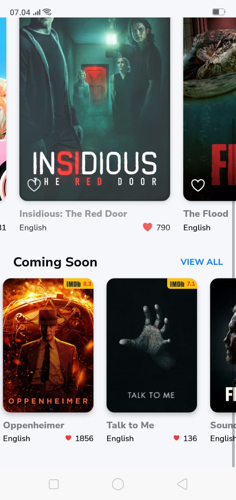
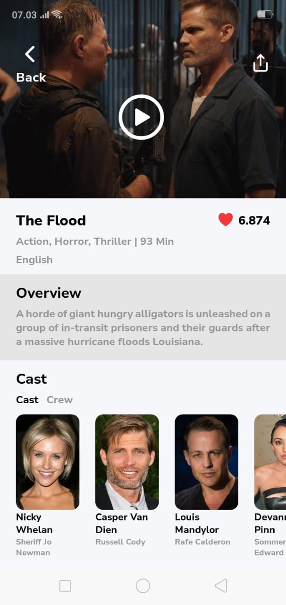
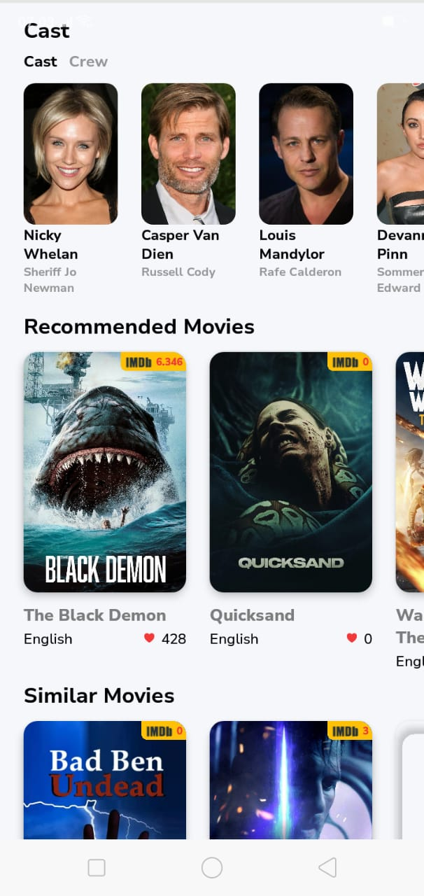
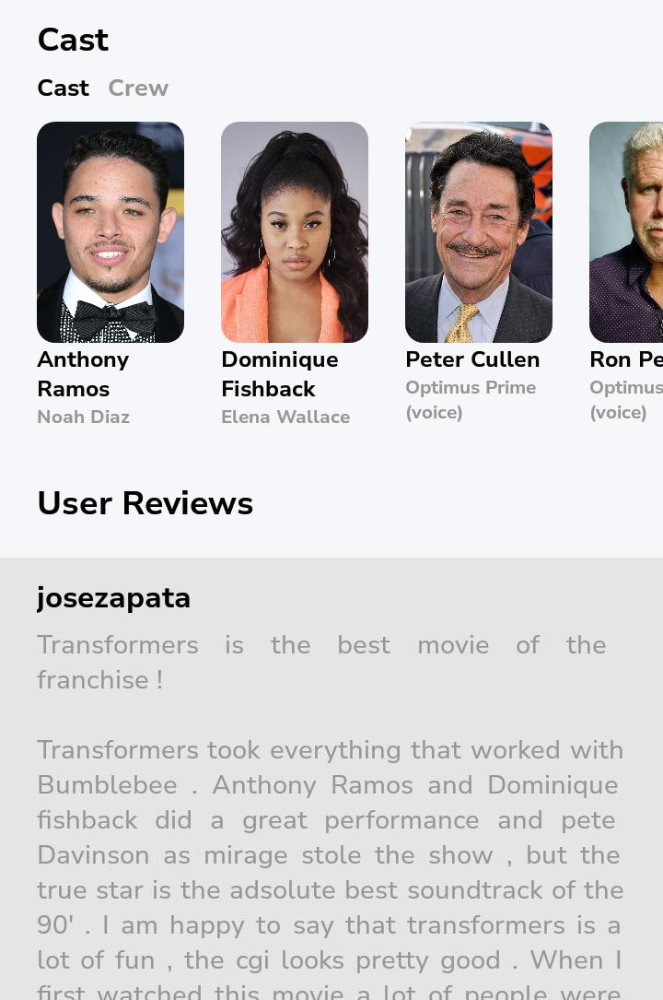
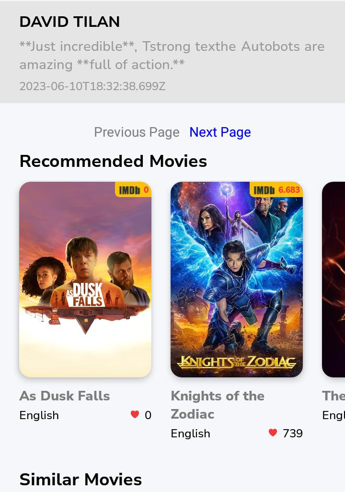

# Movie App - Film Exploration Application

The Movie App is a React Native application that allows users to browse and discover movies using data from the TMDB (The Movie Database) API. This application is built using [**React Native**](https://reactnative.dev/) and [**Expo**](https://expo.io/).

## Screenshots

Here are some screenshots of the Movie App:

### Home Screen






The Home Screen displays a list of currently playing movies and upcoming movies. Users can also filter movies by genre.

### Movie Details Screen






The Movie Details Screen displays detailed information about a selected movie, including its title, overview, release date, language, and rating.





## Dependencies

- [React Navigation](https://reactnavigation.org/): Used for screen navigation within the app.
- [Axios](https://axios-http.com/): Used for making HTTP requests to the TMDB API.
- [Expo SplashScreen](https://docs.expo.dev/versions/latest/sdk/splash-screen/): Used for managing the app's splash screen.
- [Expo LinearGradient](https://docs.expo.dev/versions/latest/sdk/linear-gradient/): Used for creating gradient backgrounds.
- [Expo Font](https://docs.expo.io/versions/latest/sdk/font/): Used for loading custom fonts.
- [Expo Status Bar](https://docs.expo.io/versions/latest/sdk/status-bar/): Used for managing the status bar appearance.

## Screens

### Home Screen

The Home Screen displays a list of currently playing movies and upcoming movies. Users can also filter movies by genre.

#### Features

- Display Now Playing Movies: Shows a horizontal list of currently playing movies with their titles, languages, and ratings.
- Display Upcoming Movies: Shows a horizontal list of upcoming movies with their titles, languages, and ratings.
- Genre Filter: Users can filter movies by genre using a horizontal list of genre cards.
- Navigation: Users can navigate to the Movie Details Screen by clicking on a movie card.

### Movie Details Screen

The Movie Details Screen displays detailed information about a selected movie.

#### Features

- Movie Information: Displays the movie title, overview, release date, language, and rating.
- Poster Image: Displays the movie's poster image.
- YouTube Trailer: Displays a YouTube trailer video of the movie.
- Back Navigation: Users can navigate back to the Home Screen.

## Components

### GenreCards

A horizontal list of genre cards that allow users to filter movies by genre.

#### Props

- `genreName` (String): The name of the genre.
- `active` (Boolean): Indicates whether the genre card is currently active.
- `onPress` (Function): A function to handle genre card press events.

### MovieCard

A card that displays movie information, including title, language, rating, and poster image.

#### Props

- `title` (String): The title of the movie.
- `language` (String): The original language of the movie.
- `voteAverage` (Number): The average rating of the movie.
- `voteCount` (Number): The total number of votes for the movie.
- `poster` (String): The relative path to the movie's poster image.
- `heartLess` (Boolean): Indicates whether to display a heart icon for liking.
- `onPress` (Function): A function to handle movie card press events.

### Pagination

A component for implementing pagination with "Previous Page" and "Next Page" buttons.

#### Props

- `currentPage` (Number): The current page of reviews.
- `totalPages` (Number): The total number of pages.
- `onNextPage` (Function): A function to handle moving to the next page.
- `onPrevPage` (Function): A function

## Setup Instructions

1. **Clone Repository**: Clone the Movie App repository using the provided Git URL.
   
```sh
   git clone https://github.com/Yusup1907/MovieApp.git
```

2. **Install all dependencies**:  Navigate to the app directory and install all required dependencies using npm.

```sh
# navigate to app directory
cd MovieApp

npm install
```

3. **Configuration**: Add IMDB API-KEY inside package.json / projectConfig.apiKey

```json
"projectConfig": {
    "apiKey": "<put the api key from imdb here>"
  }
```

4. **Start the app**:  Start the app using Expo CLI and npm.

```sh
npx expo start

# using npm
npm start
```